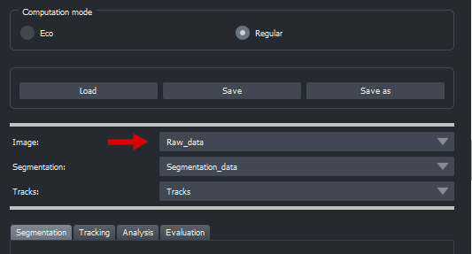

**We are actively working on the documentation**

# MMV_H4Tracks

A plugin to use with napari to segment and track cells via HumanInTheLoop(HITL)-approach.

----------------------------------

This [napari] plugin was generated with [Cookiecutter] using [@napari]'s [cookiecutter-napari-plugin] template.

<!-- ## Usage
Load a zarr-file consisting of Image, Label and Tracks layer. -->

## Installation

You can install `mmv_h4tracks` via [pip]:

    pip install mmv_h4tracks

By default, CPU is used for segmentation computing. We did our best to optimize the CPU computing time, but still recommend GPU computing. For more detailed instructions on how to install GPU support look [here](https://github.com/MouseLand/cellpose#gpu-version-cuda-on-windows-or-linux).

<!-- 

To install latest development version :

    pip install git+https://github.com/MMV-Lab/mmv_h4tracks.git -->

## Documentation
This plugin was developed to analyze 2D cell migration. It includes the function of segmenting 2D videos using [Cellpose](https://github.com/MouseLand/cellpose) (both CPU and GPU implemented) and then tracking them using different automatic tracking algorithms, depending on the use case. For both segmentation and tracking, we have implemented user-friendly options for manual curation after automatic processing. In conjunction with napari's inherent functionalities, our plugin provides the capability to automatically track data and subsequently process the tracks in three different ways based on the reliability of the automated results. Firstly, any potentially existing incorrect tracks can be rectified in a user-friendly manner, thereby maximizing the evaluation of available information. Secondly, unreliable tracks can be selectively deleted, and thirdly, individual tracks can be manually or semi-automatically created for particularly challenging data, ensuring reliable results. In essence, our tool aims to offer a valuable supplement to the existing fully automated tracking tools and a user-friendly means to analyze videos where fully automated tracking has been previously challenging.

Common metrics such as speed, cell size, velocity, etc... can then be extracted, plotted and exported from the tracks obtained in this way. Furthermore, the plugin incorporates a functionality to assess the automatic tracking outcomes using a [quality score](https://doi.org/10.1371/journal.pone.0144959). Since automated tracking may not be consistently 100% accurate, presenting a quality measure alongside scientific discoveries becomes essential. This supplementary metric offers researchers valuable insights into the dependability of the produced tracking results, fostering informed data interpretation and decision-making in the analysis of cell migration.

More detailed information and instructions on each topic can be found in the following sections.

### Get started

To load your raw data, you can simply drag & drop them into napari. Ensure that the 'Image' combobox displays the correct layer afterward, see example: 

To load your own segmentation, you can do equivalent.

The "save as" button can be used to save the existing layers (raw, segmentation, tracks) in a single .zarr file, which can be loaded again later using the "load" button. The "save" button overwrites the loaded .zarr file.

The computation mode is used to set how many of the available CPU cores (40% or 80%) are to be used for computing the CPU segmentation and tracking and therefore has a direct impact on performance.

### Segmentation

For segmentation, we use the state of the art instance segmentation method Cellpose. We provide a model that we trained and has proven successful for our application ([see more information](https://doi.org/10.1038/s41467-023-43765-3)).

(...)

#### Automatic instance segmentation

To start automatic segmentation, a model must first be selected. Automatic segmentation can then be started via "Run Segmentation". The "Preview" option offers the possibility of segmenting the first 5 frames first in order to obtain an estimate of the expected results, as the computation - depending on the data and hardware - can be time-consuming.

##### Custom models

The plugin supports adding custom Cellpose models. To do so, simply click on "Add custom Cellpose model", enter a name to be displayed, select the model path and pass the required parameters. Click [here](https://cellpose.readthedocs.io/en/latest/api.html#id0) for more information about the parameters.

To train your own Cellpose model, [this](https://cellpose.readthedocs.io/en/latest/train.html) might be helpful.
In future versions, we plan to support fine-tuning of Cellpose models within the plugin. 

#### Manual curation

We provide different options to correct the automatic segmentation:

- `Remove cell` - Click on a cell to remove it. Be aware that removing a cell cuts the track the cell is on.
- `Next free ID` - Loads the next free label ID, then a false negative cell can be manually annotated using the paint mode.
- `Select ID` - Click on a cell to load its ID, then this cell can be corrected manually using the paint mode.
- `Merge cell` - Click on 2 different fragments of the same cell to harmonize their ID. Note: This has no effect on the annotation itself.
- `Separate` - Click on a cell to assign a new ID to it.

### Tracking

The plugin supports both coordinate-based (LAP) and overlap-based tracking. Overlap-based tracking requires more computation, but can also be used in particularly complicated data for individual cells.
In our experience, coordinate-based tracking has proven itself in cases with reliable segmentation. Overlap-based tracking serves as a useful complement in cases where the segmentation is not of sufficient quality.

If necessary, overlap-based tracking can also be used for single cells. To do this, simply click on the cell after clicking the button.

#### Manual curation

To correct tracks, the plugin allows you to link or unlink them. For both options, first click on the corresponding button and then on the cell in the respective frame. The action must then be confirmed using the previously clicked button, which now displays "confirm".

To unlink, all you need to do is click on the cell in the first and last frame. So if the cell is tracked from frame 1-100 and the track between frames 1-10 is to be deleted, it is sufficient to click on the cell in frames 1 and 10. If the track is to be deleted between frames 40-60, it is sufficient to click in frames 40 and 60. In this scenario, the rest of the track is then split, i.e. once into a track from frame 1-40 and once into a track from frame 60-100.

In contrast, to link cells, the corresponding cell in each frame must be clicked. This must be done for all frames, so the track must be gapless.

#### Visualize & filter tracks

The displayed tracks can be filtered by entering specific track IDs. An empty entry and subsequent click on the "Filter" button resets the track layer and all existing tracks are displayed.

Individual tracks can be deleted using the delete function. Note: These are permanently deleted and cannot be restored without re-tracking. In addition, all displayed tracks can be deleted.

### Analysis

The plugin supports the calculation of various metrics, which can be divided into two categories: migration-based (such as speed, direction, ...) and shape-based (such as size, eccentricity, ...). Through the use of these metrics, a comprehensive understanding of the available data can be obtained.

All these metrics can be exported to a .csv file. In addition, the tracks can be filtered with a movement minimum (in pixels) and a minimum track length (in frames). Note: All existing tracks are exported in any case, but their results are presented separately.
 
The plugin offers the option of filtering the existing tracks according to the metrics. To do this, the corresponding metric can be selected in the plot area and a scatter plot of the data points will be generated using the plot button. Individual data points (/tracks) that are to be displayed can be circled with the mouse and all tracks that are not circled will be hidden. Note: No tracks are deleted in this process. Hiding tracks triggers the filter function in the tracking section. In combination with this, entire tracks can be deleted as described above.

(...)

### Evaluation

To be aware of the accuracy of your automatic tracking and segmentation results, we have implemented an option to evaluate your automatic results. Evaluation is always carried out against the latest results of automatic segmentation and automatic tracking or previously created results loaded via the plugin's own load function. We may implement the option to evaluate external segmentations in the future, but for now you can use save and load as a workaround.

To evaluate results, at least 2 consecutive frames must first be corrected manually. The plugin saves the previously mentioned automatic or loaded results in the background, so no activation via button or similar is necessary before manual correction.

(...)

#### Segmentation evaluation

In order to evaluate the segmentation results, a segmentation must first be loaded either via the load function of the plugin (drag&drop via napari is not sufficient) or computed within the plugin. This can then be corrected manually. For IoU, Dice and F1 scores are then calculated for the frames specified by the user. These results are not exported automatically and must therefore be noted down by users themselves.

#### Tracking evaluation

As for the evaluation of the segmentation, tracking results loaded via the plugin or obtained within the plugin are required. At least 2 consecutive frames must be corrected manually so that a score can be calculated for the quality of the tracking results. More information can be found [here](https://doi.org/10.1371/journal.pone.0144959).

## Hotkeys

Here's an overview of the hotkeys. All of them can also be found in the corresponding tooltips. 

- `E` - Load next free segmentation ID
- `S` - Overlap-based single cell tracking 

## Development plan

We will continue to develop the plugin and implement new features in the future. Some of our plans in arbitrary order:

- Support of lineages
- Support training custom Cellpose models within the plugin
- Model optimization to further optimize segmentation computation
- Support evaluation of external segmentations
- ...

If you have a feature request, please [file an issue].

## Resources

The following resources may be of interest:

- [napari](https://napari.org/)
- [Cellpose](https://doi.org/10.1038/s41592-020-01018-x)

## Contributing

Contributions are very welcome. Tests can be run with [tox], please ensure
the coverage at least stays the same before you submit a pull request.

## License

Distributed under the terms of the [BSD-3] license,
"mmv_h4tracks" is free and open source software

## Issues

If you encounter any problems, please [file an issue] along with a detailed description.

[napari]: https://github.com/napari/napari
[Cookiecutter]: https://github.com/audreyr/cookiecutter
[@napari]: https://github.com/napari
[MIT]: http://opensource.org/licenses/MIT
[BSD-3]: http://opensource.org/licenses/BSD-3-Clause
[GNU GPL v3.0]: http://www.gnu.org/licenses/gpl-3.0.txt
[GNU LGPL v3.0]: http://www.gnu.org/licenses/lgpl-3.0.txt
[Apache Software License 2.0]: http://www.apache.org/licenses/LICENSE-2.0
[Mozilla Public License 2.0]: https://www.mozilla.org/media/MPL/2.0/index.txt
[cookiecutter-napari-plugin]: https://github.com/napari/cookiecutter-napari-plugin

[file an issue]: https://github.com/MMV-Lab/mmv_h4tracks/issues

[napari]: https://github.com/napari/napari
[tox]: https://tox.readthedocs.io/en/latest/
[pip]: https://pypi.org/project/pip/
[PyPI]: https://pypi.org/
